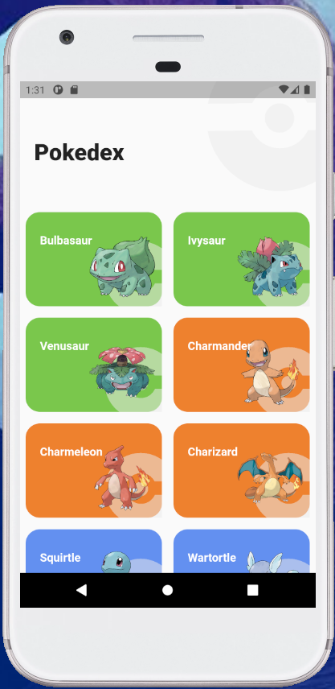
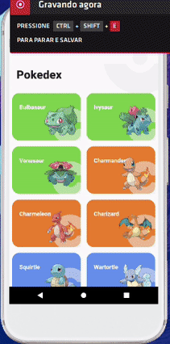

# Level Up #Extra - Pokedex

Desafio extra proposto pela Raro Academy.

## Getting Started

Level Up são desafios propostos pela Raro Academy para consolidar o conhecimento passado durante as aulas semanais da academia. Para o Level Up #Extra, foi solicitado que fizéssemos uma requisição de alguma API e mostrar sua resposta na tela do dispositivo, algo que foi trabalhado durante a aula em que desafio extra foi proposto.

## Pokedex

A API retorna todos os 151 Pokémon da primeira geração.

## To Do
- [ ] Adicionar os tipos de cada Pokémon.
- [ ] Adicionar a página de detalhes dos Pokémon. 

## Referência

- O layout teve como inspiração o template criado por [Saepul Nahwan](https://dribbble.com/saepulnahwan23) disponível no [Dribbble](https://dribbble.com/shots/6563578-Pokedex-App-Animation).
